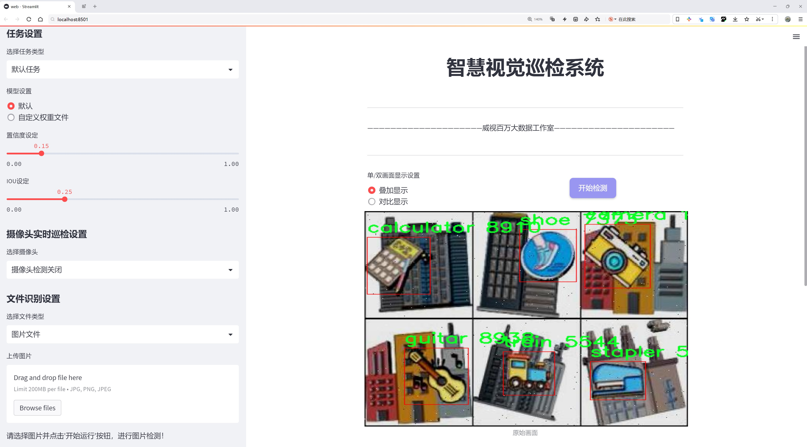
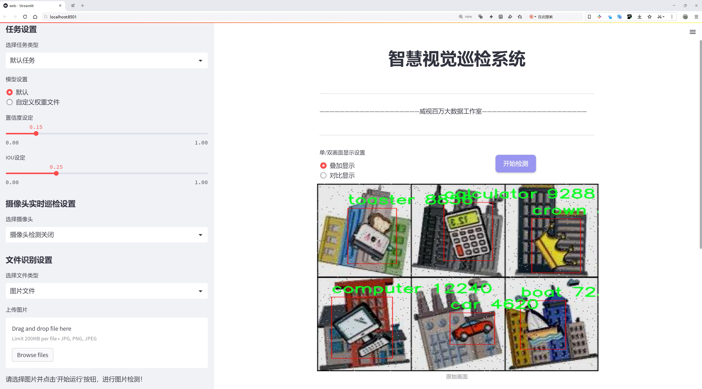
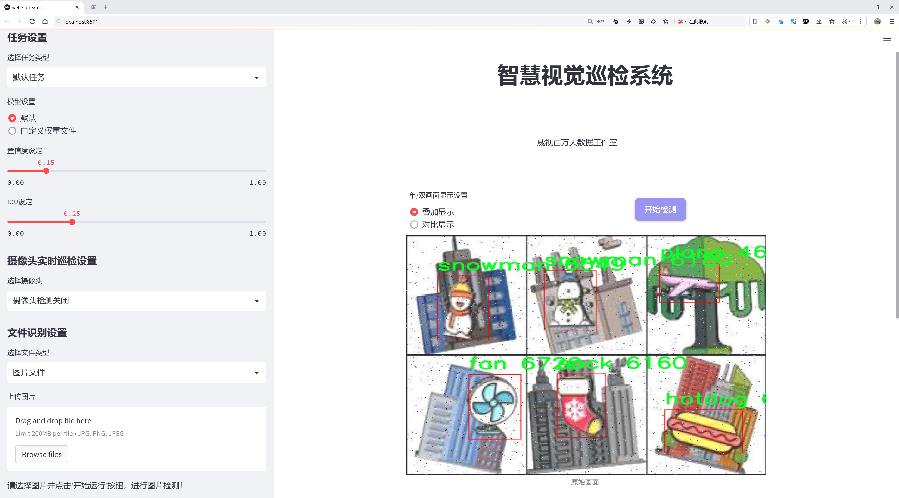
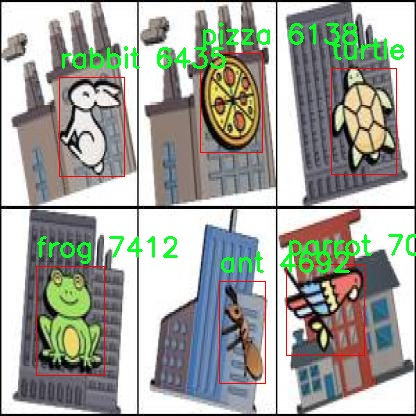
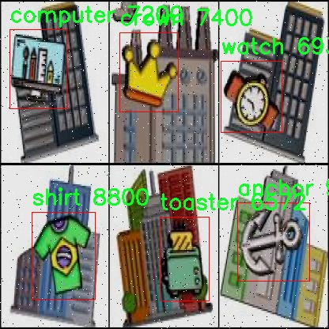
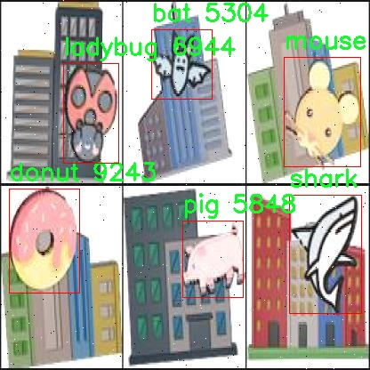
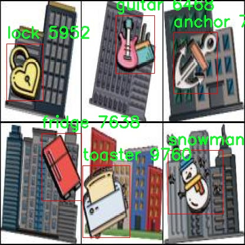
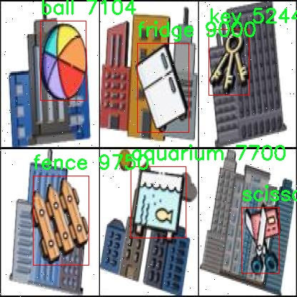

# 动画标识检测系统源码分享
 # [一条龙教学YOLOV8标注好的数据集一键训练_70+全套改进创新点发刊_Web前端展示]

### 1.研究背景与意义

项目参考[AAAI Association for the Advancement of Artificial Intelligence](https://gitee.com/qunmasj/projects)

研究背景与意义

随着人工智能技术的迅猛发展，计算机视觉在各个领域的应用日益广泛，尤其是在物体检测和识别方面。YOLO（You Only Look Once）系列模型因其高效性和实时性，成为了物体检测领域的重要工具。YOLOv8作为该系列的最新版本，进一步提升了检测精度和速度，适用于多种复杂场景。然而，现有的YOLOv8模型在特定领域，尤其是动画标识的检测中，仍然面临一些挑战。这些挑战主要体现在多样化的动画元素、复杂的背景以及标识之间的相似性等方面。因此，基于改进YOLOv8的动画标识检测系统的研究具有重要的理论和实际意义。

本研究所使用的数据集Kaptcha包含9424张图像，涵盖104个类别的动画标识，如外星人、香蕉、飞机等。这些类别不仅丰富多样，而且在视觉特征上存在较大的差异性，给物体检测算法带来了不小的挑战。通过对这些类别的深入分析，可以发现，许多动画标识具有高度的相似性，且在不同的背景下可能会产生不同的视觉效果。这就要求检测系统具备更强的特征提取能力和分类能力，以确保能够准确识别和定位各种动画标识。

在这一背景下，改进YOLOv8模型的研究显得尤为重要。通过引入新的特征提取方法、优化模型结构以及调整训练策略，可以有效提升模型在动画标识检测中的表现。例如，结合深度学习中的注意力机制，可以帮助模型更好地聚焦于关键特征，从而提高检测精度。此外，针对Kaptcha数据集中不同类别的特征分布，可以采用数据增强技术，丰富训练样本，提升模型的泛化能力。

从应用角度来看，动画标识检测系统的研究不仅限于学术领域，还在商业、娱乐、教育等多个行业中具有广泛的应用前景。在广告行业，准确的动画标识检测可以帮助品牌更好地分析市场反应和用户偏好；在游戏开发中，实时的标识检测能够提升用户体验；在教育领域，动画标识的自动识别与分类可以为智能教学提供有力支持。因此，基于改进YOLOv8的动画标识检测系统的研究，不仅推动了计算机视觉技术的发展，也为相关行业的创新应用提供了新的思路和解决方案。

综上所述，基于改进YOLOv8的动画标识检测系统的研究，既是对现有技术的深化与拓展，也是对实际应用需求的积极响应。通过系统的研究与实践，期望能够为动画标识的自动检测提供更为高效、准确的解决方案，推动相关领域的进一步发展。

### 2.图片演示







##### 注意：由于此博客编辑较早，上面“2.图片演示”和“3.视频演示”展示的系统图片或者视频可能为老版本，新版本在老版本的基础上升级如下：（实际效果以升级的新版本为准）

  （1）适配了YOLOV8的“目标检测”模型和“实例分割”模型，通过加载相应的权重（.pt）文件即可自适应加载模型。

  （2）支持“图片识别”、“视频识别”、“摄像头实时识别”三种识别模式。

  （3）支持“图片识别”、“视频识别”、“摄像头实时识别”三种识别结果保存导出，解决手动导出（容易卡顿出现爆内存）存在的问题，识别完自动保存结果并导出到。

  （4）支持Web前端系统中的标题、背景图等自定义修改，后面提供修改教程。

  另外本项目提供训练的数据集和训练教程,暂不提供权重文件（best.pt）,需要您按照教程进行训练后实现图片演示和Web前端界面演示的效果。

### 3.视频演示

[3.1 视频演示](https://www.bilibili.com/video/BV1TQsFeiEe2/?vd_source=ff015de2d29cbe2a9cdbfa7064407a08)

### 4.数据集信息展示

数据集信息展示

在本研究中，我们采用了名为“Kaptcha”的数据集，以训练和改进YOLOv8的动画标识检测系统。该数据集包含9424张高质量的图像，涵盖了104个不同的类别，旨在提供丰富的视觉信息，以支持模型在复杂场景中的物体检测能力。每一张图像都经过精心标注，确保模型能够准确识别和分类各种物体，这对于提升YOLOv8在动画标识检测中的性能至关重要。

“Kaptcha”数据集的类别多样性是其一大亮点，涵盖了从日常生活中常见的物品到奇幻生物的广泛范围。具体而言，数据集中包括了诸如外星人、香蕉、冰淇淋、狮子、火焰、宇宙飞船等多种类别。这种多样性不仅能够帮助模型学习到不同物体的特征，还能增强其在不同场景下的适应能力。例如，动物类的图像（如狗、猫、熊等）与日常物品（如计算器、沙发、冰箱等）的结合，能够使模型在面对真实世界的复杂性时，表现得更加出色。

此外，数据集中的图像质量也是其一大优势。所有9424张图像均为全彩高分辨率图像，确保了细节的清晰可见。这对于YOLOv8模型的训练至关重要，因为高质量的输入数据能够有效提升模型的学习效果，进而提高其检测精度。尤其是在动画标识的应用场景中，图像的清晰度和细节表现直接影响到模型的识别能力。

值得注意的是，该数据集的开放许可证（CC BY 4.0）使得研究人员和开发者能够自由使用和修改数据集，促进了学术界和工业界的合作与创新。这种开放性不仅推动了YOLOv8模型的进一步研究，也为其他相关领域的研究提供了宝贵的资源。

在训练过程中，我们将充分利用“Kaptcha”数据集的丰富信息，通过数据增强技术和迁移学习等方法，提升YOLOv8模型的性能。具体而言，我们将对不同类别的图像进行旋转、缩放、裁剪等处理，以增加训练样本的多样性，从而提高模型的泛化能力。此外，借助于已有的预训练模型，我们可以在“Kaptcha”数据集上进行微调，以加速模型的收敛速度和提升检测精度。

总之，“Kaptcha”数据集以其丰富的类别、多样的图像和高质量的标注，为改进YOLOv8的动画标识检测系统提供了坚实的基础。通过充分挖掘和利用该数据集中的信息，我们有望在物体检测领域取得更为显著的进展，为未来的研究和应用奠定良好的基础。











### 5.全套项目环境部署视频教程（零基础手把手教学）

[5.1 环境部署教程链接（零基础手把手教学）](https://www.ixigua.com/7404473917358506534?logTag=c807d0cbc21c0ef59de5)


[5.2 安装Python虚拟环境创建和依赖库安装视频教程链接（零基础手把手教学）](https://www.ixigua.com/7404474678003106304?logTag=1f1041108cd1f708b01a)

### 6.手把手YOLOV8训练视频教程（零基础小白有手就能学会）

[6.1 环境部署教程链接（零基础手把手教学）](https://www.ixigua.com/7404477157818401292?logTag=d31a2dfd1983c9668658)

### 7.70+种全套YOLOV8创新点代码加载调参视频教程（一键加载写好的改进模型的配置文件）

[7.1 环境部署教程链接（零基础手把手教学）](https://www.ixigua.com/7404478314661806627?logTag=29066f8288e3f4eea3a4)

### 8.70+种全套YOLOV8创新点原理讲解（非科班也可以轻松写刊发刊，V10版本正在科研待更新）

由于篇幅限制，每个创新点的具体原理讲解就不一一展开，具体见下列网址中的创新点对应子项目的技术原理博客网址【Blog】：


[8.1 70+种全套YOLOV8创新点原理讲解链接](https://gitee.com/qunmasj/good)

### 9.系统功能展示（检测对象为举例，实际内容以本项目数据集为准）

图1.系统支持检测结果表格显示

  图2.系统支持置信度和IOU阈值手动调节

  图3.系统支持自定义加载权重文件best.pt(需要你通过步骤5中训练获得)

  图4.系统支持摄像头实时识别

  图5.系统支持图片识别

  图6.系统支持视频识别

  图7.系统支持识别结果文件自动保存

  图8.系统支持Excel导出检测结果数据


### 10.原始YOLOV8算法原理

原始YOLOv8算法原理

YOLOv8作为目标检测领域的最新进展，继承并发展了YOLO系列的优良传统，结合了YOLOv5和YOLOv7的核心思想，形成了一种高效且精确的目标检测算法。该算法的设计理念是通过简化模型结构、增强特征提取能力以及引入新的损失函数，来提升目标检测的性能和速度。YOLOv8的网络结构依然由输入层、主干网络、特征融合层和解耦头组成，展现出其在设计上的一致性与创新性。

在主干网络方面，YOLOv8采用了CSPDarknet的设计理念，继续使用YOLOv5的基础架构，但将C3模块替换为C2f模块。C2f模块的引入不仅实现了模型的轻量化，还在不损失检测精度的前提下，增强了特征提取的能力。C2f模块通过引入ELAN思想，增加了多个shortcut连接，使得深层网络中的梯度流动更加顺畅，从而有效缓解了梯度消失的问题。这种设计允许模型在进行特征提取时，能够同时捕捉到局部特征和全局特征，提高了目标检测的准确性。

YOLOv8的特征融合层采用了PAN-FPN结构，这一结构的设计目的是为了实现多尺度特征的有效融合。PAN-FPN通过自下而上的特征融合和自上而下的特征传递，确保了不同层次特征的充分利用。具体而言，YOLOv8在上采样阶段删除了YOLOv5中的1x1卷积，直接将高层特征进行上采样后与中层特征进行拼接，进而传递至C2f模块。这种设计使得高层特征的语义信息与浅层特征的细节信息得以充分结合，提升了模型对目标的检测能力。

YOLOv8在检测头的设计上也进行了显著的创新，采用了Anchor-Free的检测策略，抛弃了传统的Anchor-Based方法。这一转变使得模型在处理不同尺寸的目标时更加灵活，避免了Anchor选择不当带来的性能损失。YOLOv8的解耦头结构分为分类和回归两个独立的分支，简化了目标检测的流程，同时提高了检测的精度。通过使用Distribution Focal Loss和CIoU Loss，YOLOv8能够更好地处理样本不平衡的问题，尤其是在面对小目标和难以识别的目标时，提升了模型的鲁棒性。

在损失函数的设计上，YOLOv8引入了VFLLoss作为分类损失，DFLLoss和CIoULoss作为回归损失。这种组合不仅提高了模型在训练过程中的收敛速度，还有效提升了检测精度。VFLLoss通过调节样本的权重，帮助模型更好地聚焦于难以分类的样本，特别是在样本不平衡的情况下，能够显著改善模型的学习效果。

在数据预处理方面，YOLOv8采用了YOLOv5的策略，结合了马赛克增强、混合增强、空间扰动和颜色扰动等多种数据增强手段。这些增强手段的使用不仅丰富了训练数据的多样性，还提高了模型的泛化能力，使得YOLOv8在实际应用中能够更好地适应不同的场景和条件。

YOLOv8的设计充分考虑了实时性与精度的平衡，能够在多种硬件平台上高效运行。其模型结构的简化和优化，使得YOLOv8在执行速度上优于以往的模型，同时在精度上也有显著提升。通过对YOLOv5、YOLOv6和YOLOX等模型的优点进行综合，YOLOv8不仅在目标检测任务中表现出色，还在实例分割和姿态评估等任务中展现了强大的能力。

总的来说，YOLOv8的原始算法原理体现了对目标检测技术的深刻理解与创新，结合了多种先进的设计理念与技术手段，使其在目标检测领域中占据了领先地位。随着YOLOv8的推出，目标检测的精度和效率得到了进一步提升，为计算机视觉的应用开辟了新的可能性。


### 11.项目核心源码讲解（再也不用担心看不懂代码逻辑）

#### 11.1 ultralytics\models\utils\ops.py

下面是对给定代码的核心部分进行分析和详细注释的结果：

```python
import torch
import torch.nn as nn
import torch.nn.functional as F
from scipy.optimize import linear_sum_assignment
from ultralytics.utils.metrics import bbox_iou

class HungarianMatcher(nn.Module):
    """
    实现匈牙利算法匹配器的模块，用于在预测的边界框和真实边界框之间进行最优匹配。
    """

    def __init__(self, cost_gain=None, use_fl=True, with_mask=False, num_sample_points=12544, alpha=0.25, gamma=2.0):
        """
        初始化匈牙利匹配器，设置成本系数、焦点损失、掩码预测等参数。
        """
        super().__init__()
        if cost_gain is None:
            cost_gain = {"class": 1, "bbox": 5, "giou": 2, "mask": 1, "dice": 1}
        self.cost_gain = cost_gain  # 成本系数
        self.use_fl = use_fl  # 是否使用焦点损失
        self.with_mask = with_mask  # 是否进行掩码预测
        self.num_sample_points = num_sample_points  # 掩码成本计算中使用的采样点数量
        self.alpha = alpha  # 焦点损失中的alpha因子
        self.gamma = gamma  # 焦点损失中的gamma因子

    def forward(self, pred_bboxes, pred_scores, gt_bboxes, gt_cls, gt_groups, masks=None, gt_mask=None):
        """
        前向传播，计算预测与真实之间的匹配。
        """
        bs, nq, nc = pred_scores.shape  # 获取批次大小、查询数量和类别数量

        if sum(gt_groups) == 0:  # 如果没有真实目标，返回空匹配
            return [(torch.tensor([], dtype=torch.long), torch.tensor([], dtype=torch.long)) for _ in range(bs)]

        # 扁平化预测分数和边界框
        pred_scores = pred_scores.detach().view(-1, nc)
        pred_scores = F.sigmoid(pred_scores) if self.use_fl else F.softmax(pred_scores, dim=-1)
        pred_bboxes = pred_bboxes.detach().view(-1, 4)

        # 计算分类成本
        pred_scores = pred_scores[:, gt_cls]  # 选择与真实类别对应的预测分数
        if self.use_fl:
            # 计算焦点损失的正负成本
            neg_cost_class = (1 - self.alpha) * (pred_scores**self.gamma) * (-(1 - pred_scores + 1e-8).log())
            pos_cost_class = self.alpha * ((1 - pred_scores) ** self.gamma) * (-(pred_scores + 1e-8).log())
            cost_class = pos_cost_class - neg_cost_class
        else:
            cost_class = -pred_scores  # 直接使用负分数作为成本

        # 计算边界框之间的L1成本
        cost_bbox = (pred_bboxes.unsqueeze(1) - gt_bboxes.unsqueeze(0)).abs().sum(-1)

        # 计算GIoU成本
        cost_giou = 1.0 - bbox_iou(pred_bboxes.unsqueeze(1), gt_bboxes.unsqueeze(0), xywh=True, GIoU=True).squeeze(-1)

        # 组合最终成本矩阵
        C = (
            self.cost_gain["class"] * cost_class
            + self.cost_gain["bbox"] * cost_bbox
            + self.cost_gain["giou"] * cost_giou
        )

        # 处理掩码成本（如果需要）
        if self.with_mask:
            C += self._cost_mask(bs, gt_groups, masks, gt_mask)

        # 将无效值（NaN和无穷大）设置为0
        C[C.isnan() | C.isinf()] = 0.0

        C = C.view(bs, nq, -1).cpu()  # 重新调整成本矩阵形状
        indices = [linear_sum_assignment(c[i]) for i, c in enumerate(C.split(gt_groups, -1))]  # 使用匈牙利算法计算匹配
        gt_groups = torch.as_tensor([0, *gt_groups[:-1]]).cumsum_(0)  # 计算真实目标的索引
        return [
            (torch.tensor(i, dtype=torch.long), torch.tensor(j, dtype=torch.long) + gt_groups[k])
            for k, (i, j) in enumerate(indices)
        ]

# 省略的 _cost_mask 方法，主要用于计算掩码的成本
```

### 代码分析
1. **匈牙利算法匹配器**：该类用于在预测的边界框和真实的边界框之间进行最优匹配，主要通过计算不同成本（分类成本、边界框成本和GIoU成本）来实现。

2. **初始化方法**：在初始化中，设置了成本系数、是否使用焦点损失、是否进行掩码预测等参数。

3. **前向传播方法**：该方法是匹配器的核心，负责计算成本并返回匹配结果。首先对输入的预测边界框和分数进行处理，然后计算分类成本、L1成本和GIoU成本，最后通过匈牙利算法找到最佳匹配。

4. **成本计算**：通过不同的成本计算方式（如焦点损失和L1距离）来评估预测和真实值之间的差异，最终形成一个综合的成本矩阵。

5. **处理无效值**：在计算成本时，可能会出现无效值（如NaN或无穷大），需要将其处理为0，以避免在后续计算中出现错误。

### 结论
这个代码实现了一个高效的匈牙利算法匹配器，能够在目标检测任务中用于匹配预测的边界框和真实的边界框。通过详细的成本计算和处理机制，确保了匹配的准确性和有效性。

这个文件定义了一个名为 `HungarianMatcher` 的类，主要用于在目标检测任务中解决预测框与真实框之间的匹配问题。该类通过实现匈牙利算法，能够在端到端的训练过程中进行最优分配。匹配的成本函数考虑了分类分数、边界框坐标以及可选的掩码预测。

在 `HungarianMatcher` 的构造函数中，初始化了一些属性，包括成本系数（如分类、边界框、GIoU、掩码和Dice系数的权重）、是否使用焦点损失、是否进行掩码预测、样本点数量以及焦点损失的超参数（alpha 和 gamma）。如果没有提供成本系数，则使用默认值。

`forward` 方法是该类的核心功能，接受预测的边界框、分数、真实的边界框、类别、组信息以及可选的掩码作为输入。首先，它将输入的张量展平以便于计算成本矩阵。接着，计算分类成本、边界框的L1成本和GIoU成本。分类成本的计算根据是否使用焦点损失而有所不同。最终，将所有成本结合成一个总成本矩阵，并通过匈牙利算法找到最佳匹配。

如果模型支持掩码预测，还会调用 `_cost_mask` 方法计算掩码成本（该方法目前被注释掉，可能是为未来的模型保留的功能）。最终，返回每个批次中预测框和真实框的索引。

此外，文件中还定义了一个 `get_cdn_group` 函数，用于生成对比去噪训练组。该函数通过对真实标签和边界框添加噪声，创建正负样本的训练组。函数的输入包括批次数据、类别数、查询数、类别嵌入、去噪数量、类别噪声比例、边界框噪声比例以及训练模式标志。根据输入参数，函数生成带有噪声的类别和边界框，并返回修改后的标签、边界框、注意力掩码和元信息。

整体来看，这个文件实现了目标检测中重要的匹配机制，并为对比学习提供了支持，能够有效地处理预测与真实数据之间的关系。

#### 11.2 ultralytics\engine\model.py

以下是经过简化和注释的核心代码部分：

```python
import inspect
import sys
from pathlib import Path
from typing import Union
from ultralytics.nn import nn  # 导入nn模块以使用神经网络基础类

class Model(nn.Module):
    """
    YOLO模型的基础类，统一所有模型的API。

    参数:
        model (str, Path): 要加载或创建的模型文件路径。
        task (Any, optional): YOLO模型的任务类型。默认为None。
    """

    def __init__(self, model: Union[str, Path] = "yolov8n.pt", task=None, verbose=False) -> None:
        """
        初始化YOLO模型。

        参数:
            model (Union[str, Path], optional): 要加载或创建的模型路径或名称。默认为'yolov8n.pt'。
            task (Any, optional): YOLO模型的任务类型。默认为None。
            verbose (bool, optional): 是否启用详细模式。
        """
        super().__init__()  # 调用父类构造函数
        self.model = None  # 模型对象
        self.task = task  # 任务类型
        self.model_name = str(model).strip()  # 去除模型名称的空格

        # 检查是否为Ultralytics HUB模型
        if self.is_hub_model(model):
            self.session = self._get_hub_session(model)  # 获取HUB会话
            model = self.session.model_file  # 从HUB获取模型文件

        # 加载或创建新的YOLO模型
        model = self.check_model_file(model)  # 检查模型文件后缀
        if Path(model).suffix in (".yaml", ".yml"):
            self._new(model, task=task, verbose=verbose)  # 从配置文件创建新模型
        else:
            self._load(model, task=task)  # 从权重文件加载模型

    def _new(self, cfg: str, task=None, model=None, verbose=False):
        """
        初始化新模型并从模型定义推断任务类型。

        参数:
            cfg (str): 模型配置文件
            task (str | None): 模型任务
            model (BaseModel): 自定义模型。
            verbose (bool): 加载时显示模型信息
        """
        cfg_dict = self.yaml_model_load(cfg)  # 加载yaml配置
        self.cfg = cfg
        self.task = task or self.guess_model_task(cfg_dict)  # 推断任务类型
        self.model = (model or self._smart_load("model"))(cfg_dict, verbose=verbose)  # 创建模型

    def _load(self, weights: str, task=None):
        """
        从权重文件加载模型并推断任务类型。

        参数:
            weights (str): 要加载的模型检查点
            task (str | None): 模型任务
        """
        self.model, self.ckpt = self.attempt_load_one_weight(weights)  # 尝试加载权重
        self.task = self.model.args["task"]  # 获取任务类型

    def predict(self, source=None, stream=False, **kwargs):
        """
        使用YOLO模型进行预测。

        参数:
            source (str | int | PIL | np.ndarray): 进行预测的图像源。
            stream (bool): 是否流式传输预测结果。默认为False。

        返回:
            (List[ultralytics.engine.results.Results]): 预测结果。
        """
        if source is None:
            source = "default_source"  # 默认源
        # 处理预测逻辑
        return self.predictor.predict(source=source, stream=stream)  # 调用预测器进行预测

    @staticmethod
    def is_hub_model(model):
        """检查提供的模型是否为HUB模型。"""
        return model.startswith("https://hub.ultralytics.com/models/")  # 检查模型URL是否符合HUB格式

    def _get_hub_session(self, model: str):
        """为HUB训练创建会话。"""
        from ultralytics.hub.session import HUBTrainingSession
        session = HUBTrainingSession(model)  # 创建HUB训练会话
        return session if session.client.authenticated else None  # 返回会话或None

    def _smart_load(self, key):
        """加载模型/训练器/验证器/预测器。"""
        try:
            return self.task_map[self.task][key]  # 根据任务类型获取相应的类
        except Exception as e:
            raise NotImplementedError(f"模型不支持该任务类型: {self.task}") from e  # 抛出未实现错误

    @property
    def task_map(self):
        """任务映射到模型、训练器、验证器和预测器类的映射。"""
        raise NotImplementedError("请提供模型的任务映射！")  # 抛出未实现错误
```

### 代码注释说明：
1. **类定义**：`Model`类是YOLO模型的基础类，统一了所有模型的API。
2. **构造函数**：初始化模型的基本属性，包括模型路径、任务类型等。
3. **模型加载**：根据提供的路径加载模型，支持从HUB和权重文件加载。
4. **预测方法**：实现了模型的预测功能，接受不同类型的输入源。
5. **静态方法**：检查模型是否为HUB模型，并创建HUB会话。
6. **任务映射**：提供了一个任务映射的接口，供子类实现。

通过以上注释，代码的功能和结构变得更加清晰，便于理解和使用。

这个程序文件定义了一个名为 `Model` 的类，主要用于统一不同 YOLO 模型的 API。该类继承自 PyTorch 的 `nn.Module`，并提供了一系列方法和属性，以便于加载、训练、预测和评估模型。

在类的初始化方法 `__init__` 中，用户可以传入模型文件的路径或名称、任务类型以及是否启用详细模式。初始化过程中，程序会检查模型是否来自 Ultralytics HUB 或 Triton Server，并根据需要加载相应的模型文件。如果传入的是 YAML 配置文件，则调用 `_new` 方法初始化新模型；如果是权重文件，则调用 `_load` 方法加载模型。

`__call__` 方法是 `predict` 方法的别名，允许用户通过调用类的实例来进行预测。类中还定义了一些静态方法，例如 `_get_hub_session`、`is_triton_model` 和 `is_hub_model`，用于检查模型来源和创建会话。

`_new` 和 `_load` 方法分别用于初始化新模型和加载已有模型。`_check_is_pytorch_model` 方法确保当前模型是 PyTorch 格式，否则会抛出类型错误。`reset_weights` 方法用于重置模型的参数，`load` 方法则用于加载权重。

`info` 方法用于记录模型信息，`fuse` 方法用于融合模型的卷积层和批归一化层，以加快推理速度。`embed` 方法用于获取图像嵌入，`predict` 方法执行预测，支持多种输入源。

此外，类中还提供了 `track` 方法用于对象跟踪，`val` 方法用于验证模型，`benchmark` 方法用于基准测试，`export` 方法用于导出模型，`train` 方法用于训练模型。`tune` 方法则用于超参数调优。

在模型的属性方面，`names` 返回模型的类别名称，`device` 返回模型所在的设备，`transforms` 返回模型的变换操作。类还支持添加和清除回调函数，以便在特定事件发生时执行自定义操作。

最后，`task_map` 属性用于映射任务到相应的模型、训练器、验证器和预测器类，但该方法未实现，提示用户需要提供相应的任务映射。整体来看，这个类为 YOLO 模型的使用提供了一个高层次的接口，简化了模型的加载、训练和推理过程。

#### 11.3 ui.py

```python
import sys
import subprocess

def run_script(script_path):
    """
    使用当前 Python 环境运行指定的脚本。

    Args:
        script_path (str): 要运行的脚本路径

    Returns:
        None
    """
    # 获取当前 Python 解释器的路径
    python_path = sys.executable

    # 构建运行命令，使用 streamlit 运行指定的脚本
    command = f'"{python_path}" -m streamlit run "{script_path}"'

    # 执行命令
    result = subprocess.run(command, shell=True)
    # 检查命令执行结果，如果返回码不为0，表示出错
    if result.returncode != 0:
        print("脚本运行出错。")

# 主程序入口
if __name__ == "__main__":
    # 指定要运行的脚本路径
    script_path = "web.py"  # 这里可以替换为实际的脚本路径

    # 调用函数运行脚本
    run_script(script_path)
```

### 代码注释说明：
1. **导入模块**：
   - `sys`：用于获取当前 Python 解释器的路径。
   - `subprocess`：用于执行外部命令。

2. **定义 `run_script` 函数**：
   - 该函数接收一个脚本路径作为参数，并在当前 Python 环境中运行该脚本。
   - 使用 `sys.executable` 获取当前 Python 解释器的路径。
   - 构建一个命令字符串，使用 `streamlit` 模块运行指定的脚本。
   - 使用 `subprocess.run` 执行命令，并检查返回码以判断脚本是否成功运行。

3. **主程序入口**：
   - 使用 `if __name__ == "__main__":` 确保只有在直接运行该脚本时才会执行以下代码。
   - 指定要运行的脚本路径（这里为 `web.py`）。
   - 调用 `run_script` 函数，传入脚本路径以执行该脚本。

这个程序文件名为 `ui.py`，其主要功能是通过当前的 Python 环境运行一个指定的脚本，具体是一个名为 `web.py` 的文件。程序首先导入了必要的模块，包括 `sys`、`os` 和 `subprocess`，以及一个自定义的路径处理模块 `abs_path`。

在 `run_script` 函数中，程序接受一个参数 `script_path`，这个参数是要运行的脚本的路径。函数内部首先获取当前 Python 解释器的路径，使用 `sys.executable` 来实现。接着，程序构建一个命令字符串，该命令用于调用 `streamlit` 模块并运行指定的脚本。命令的格式是 `"{python_path}" -m streamlit run "{script_path}"`，其中 `python_path` 是当前 Python 解释器的路径，`script_path` 是要运行的脚本路径。

然后，程序使用 `subprocess.run` 方法来执行这个命令，`shell=True` 参数允许在 shell 中执行命令。执行后，程序检查返回的结果，如果返回码不为 0，表示脚本运行出错，程序会打印出“脚本运行出错。”的提示信息。

在文件的最后部分，使用 `if __name__ == "__main__":` 语句来确保只有在直接运行该脚本时才会执行后面的代码。在这里，程序调用 `abs_path` 函数来获取 `web.py` 的绝对路径，并将其传递给 `run_script` 函数以执行该脚本。

总体来说，这个程序的主要作用是提供一个简单的接口，通过当前的 Python 环境来运行一个 Streamlit 应用脚本，并处理可能出现的错误。

#### 11.4 train.py

以下是代码中最核心的部分，并附上详细的中文注释：

```python
import os
import torch
import yaml
from ultralytics import YOLO  # 导入YOLO模型库
from QtFusion.path import abs_path  # 导入路径处理工具

# 设置设备为GPU（如果可用），否则使用CPU
device = "0" if torch.cuda.is_available() else "cpu"

if __name__ == '__main__':  # 确保该模块被直接运行时才执行以下代码
    workers = 1  # 设置数据加载的工作进程数
    batch = 2    # 设置每个批次的大小

    data_name = "data"  # 数据集名称
    # 获取数据集yaml文件的绝对路径
    data_path = abs_path(f'datasets/{data_name}/{data_name}.yaml', path_type='current')  
    unix_style_path = data_path.replace(os.sep, '/')  # 将路径转换为Unix风格

    # 获取数据集目录路径
    directory_path = os.path.dirname(unix_style_path)
    
    # 读取YAML文件，保持原有顺序
    with open(data_path, 'r') as file:
        data = yaml.load(file, Loader=yaml.FullLoader)
    
    # 如果YAML文件中包含'path'项，则修改为当前目录路径
    if 'path' in data:
        data['path'] = directory_path
        # 将修改后的数据写回YAML文件
        with open(data_path, 'w') as file:
            yaml.safe_dump(data, file, sort_keys=False)

    # 加载预训练的YOLOv8模型
    model = YOLO(model='./ultralytics/cfg/models/v8/yolov8s.yaml', task='detect')  
    
    # 开始训练模型
    results2 = model.train(  
        data=data_path,  # 指定训练数据的配置文件路径
        device=device,  # 使用指定的设备进行训练
        workers=workers,  # 使用的工作进程数
        imgsz=640,  # 输入图像的大小为640x640
        epochs=100,  # 训练100个epoch
        batch=batch,  # 每个批次的大小
        name='train_v8_' + data_name  # 指定训练任务的名称
    )
```

### 代码核心部分解释：
1. **导入必要的库**：引入了操作系统处理、PyTorch、YAML解析和YOLO模型库。
2. **设备选择**：根据是否有可用的GPU选择计算设备。
3. **数据集路径处理**：读取指定名称的数据集的YAML配置文件，并修改其中的路径信息以确保正确性。
4. **模型加载与训练**：加载YOLOv8模型并开始训练，指定训练的参数如数据路径、设备、工作进程数、图像大小、训练轮数和批次大小。

这个程序文件`train.py`的主要功能是使用YOLOv8模型进行目标检测的训练。程序首先导入了一些必要的库，包括`os`、`torch`、`yaml`和`ultralytics`中的YOLO模型。接着，它根据系统是否支持CUDA来选择使用GPU还是CPU进行计算。

在`__main__`模块中，程序设置了一些训练参数，包括工作进程数量和批次大小。接下来，程序定义了数据集的名称，并构建了数据集配置文件的绝对路径。它使用`abs_path`函数来获取路径，并将路径中的分隔符统一为Unix风格。

程序然后获取了数据集目录的路径，并打开指定的YAML文件以读取数据集的配置。在读取YAML文件后，程序检查是否存在`path`项，如果存在，则将其修改为数据集目录的路径，并将更新后的数据写回到YAML文件中，以确保后续的训练能够正确找到数据集。

接下来，程序加载了预训练的YOLOv8模型，指定了模型的配置文件。然后，使用`model.train`方法开始训练模型。在训练过程中，程序指定了训练数据的配置文件路径、计算设备、工作进程数量、输入图像的大小、训练的epoch数量以及每个批次的大小。最后，训练任务的名称也被指定为`train_v8_`加上数据集的名称。

整体而言，这段代码实现了YOLOv8模型的训练准备和启动过程，确保了数据集配置的正确性，并通过设置合适的参数来进行模型训练。

#### 11.5 ultralytics\utils\__init__.py

以下是代码中最核心的部分，并附上详细的中文注释：

```python
import os
import platform
import logging
from pathlib import Path
import torch
import yaml

# 获取当前操作系统的信息
MACOS, LINUX, WINDOWS = (platform.system() == x for x in ["Darwin", "Linux", "Windows"])  # 判断当前操作系统类型

# 设置默认配置文件路径
ROOT = Path(__file__).resolve().parents[1]  # 获取当前文件的父目录
DEFAULT_CFG_PATH = ROOT / "cfg/default.yaml"  # 默认配置文件路径

# 设置日志记录
def set_logging(name="ultralytics", verbose=True):
    """设置日志记录，支持UTF-8编码。"""
    level = logging.INFO if verbose else logging.ERROR  # 根据verbose设置日志级别

    # 创建并配置StreamHandler
    stream_handler = logging.StreamHandler()
    stream_handler.setLevel(level)

    logger = logging.getLogger(name)  # 获取日志记录器
    logger.setLevel(level)
    logger.addHandler(stream_handler)  # 添加处理器
    return logger

# 设置全局日志记录器
LOGGER = set_logging(verbose=True)  # 定义全局日志记录器

# 加载YAML配置文件
def yaml_load(file="data.yaml"):
    """从YAML文件加载数据。"""
    with open(file, errors="ignore", encoding="utf-8") as f:
        return yaml.safe_load(f) or {}  # 返回加载的数据，若文件为空则返回空字典

# 默认配置
DEFAULT_CFG_DICT = yaml_load(DEFAULT_CFG_PATH)  # 加载默认配置
DEFAULT_CFG = SimpleNamespace(**DEFAULT_CFG_DICT)  # 将配置转换为简单命名空间对象

# 检查网络连接
def is_online() -> bool:
    """检查网络连接。"""
    import socket
    for host in ["1.1.1.1", "8.8.8.8"]:  # 测试连接的主机
        try:
            socket.create_connection((host, 53), timeout=2)  # 尝试连接
            return True  # 如果连接成功，返回True
        except OSError:
            continue
    return False  # 如果所有连接都失败，返回False

ONLINE = is_online()  # 检查当前是否在线

# 定义简单类，用于更好的字符串表示和错误报告
class SimpleClass:
    """提供简单的字符串表示和错误报告功能的基类。"""
    def __str__(self):
        """返回对象的可读字符串表示。"""
        return f"{self.__class__.__name__} object"

# 线程安全的装饰器
class ThreadingLocked:
    """确保函数的线程安全执行的装饰器类。"""
    def __init__(self):
        self.lock = threading.Lock()  # 创建锁对象

    def __call__(self, f):
        """装饰器方法，确保线程安全。"""
        @wraps(f)
        def decorated(*args, **kwargs):
            with self.lock:  # 使用锁确保线程安全
                return f(*args, **kwargs)
        return decorated

# 保存YAML数据到文件
def yaml_save(file="data.yaml", data=None):
    """将数据以YAML格式保存到文件。"""
    if data is None:
        data = {}
    with open(file, "w", encoding="utf-8") as f:
        yaml.safe_dump(data, f, sort_keys=False)  # 将数据写入文件

# 检查当前环境是否为Docker
def is_docker() -> bool:
    """检查当前脚本是否在Docker容器中运行。"""
    return Path("/proc/self/cgroup").exists() and "docker" in Path("/proc/self/cgroup").read_text()

# 获取用户配置目录
def get_user_config_dir(sub_dir="Ultralytics"):
    """获取用户配置目录。"""
    if WINDOWS:
        path = Path.home() / "AppData" / "Roaming" / sub_dir  # Windows路径
    elif MACOS:
        path = Path.home() / "Library" / "Application Support" / sub_dir  # macOS路径
    elif LINUX:
        path = Path.home() / ".config" / sub_dir  # Linux路径
    else:
        raise ValueError(f"不支持的操作系统: {platform.system()}")  # 抛出不支持的操作系统异常

    path.mkdir(parents=True, exist_ok=True)  # 创建目录
    return path

USER_CONFIG_DIR = get_user_config_dir()  # 获取用户配置目录
```

### 代码注释说明
1. **导入模块**：导入所需的标准库和第三方库。
2. **操作系统判断**：通过`platform`模块判断当前操作系统类型。
3. **日志记录设置**：定义`set_logging`函数以配置日志记录，支持不同的日志级别。
4. **YAML文件处理**：定义`yaml_load`和`yaml_save`函数以加载和保存YAML格式的数据。
5. **网络连接检查**：定义`is_online`函数以检查当前的网络连接状态。
6. **线程安全**：定义`ThreadingLocked`类作为装饰器，确保被装饰的函数在多线程环境下的安全执行。
7. **用户配置目录**：定义`get_user_config_dir`函数以获取用户的配置目录，支持不同操作系统的路径格式。

这些核心部分是实现YOLOv8功能的基础，涉及到日志记录、配置管理、线程安全等重要功能。

这个程序文件是Ultralytics YOLO项目中的一个工具模块，主要用于提供一些实用的功能和设置，帮助用户更好地使用YOLO模型。以下是对文件内容的详细说明。

首先，文件引入了一些必要的库，包括标准库和第三方库，如`cv2`、`torch`、`yaml`等。这些库提供了图像处理、深度学习、YAML文件操作等功能。

接着，文件定义了一些常量和环境变量，例如`RANK`和`LOCAL_RANK`用于多GPU训练的分布式设置，`ROOT`和`ASSETS`用于指定项目的根目录和默认图像路径。还有一些与线程和日志相关的设置，例如最大线程数和日志详细程度。

文件中包含一个帮助信息字符串`HELP_MSG`，提供了如何使用YOLOv8的示例，包括安装包、使用Python SDK和命令行接口的示例。这些示例为用户提供了快速上手的指南。

接下来，文件定义了一些类和函数。`TQDM`类是对`tqdm`进度条的自定义扩展，允许用户根据需要调整进度条的显示格式。`SimpleClass`和`IterableSimpleNamespace`类提供了更方便的属性访问和调试信息展示功能。

`plt_settings`函数是一个装饰器，用于临时设置Matplotlib的绘图参数和后端，方便用户在绘图时使用特定的设置。`set_logging`函数用于设置日志记录，确保日志以UTF-8编码输出，并根据不同的环境配置日志级别。

文件中还定义了一些与YAML文件操作相关的函数，如`yaml_save`和`yaml_load`，用于保存和加载YAML格式的数据。`yaml_print`函数则用于美观地打印YAML文件内容。

此外，文件还包含了一些环境检测函数，例如`is_ubuntu`、`is_colab`、`is_kaggle`等，用于判断当前运行环境。这些函数帮助用户了解程序的运行环境，以便进行相应的配置。

在文件的最后部分，程序进行了一些初始化操作，包括检查首次安装步骤、设置全局变量、应用猴子补丁等。这些操作确保了程序在启动时能够正确配置和运行。

总体而言，这个文件为Ultralytics YOLO项目提供了多种实用的工具和功能，帮助用户更方便地使用和配置YOLO模型。

#### 11.6 ultralytics\models\rtdetr\train.py

以下是经过简化和注释的核心代码部分：

```python
# 导入必要的库
from copy import copy
import torch
from ultralytics.models.yolo.detect import DetectionTrainer
from ultralytics.nn.tasks import RTDETRDetectionModel
from ultralytics.utils import RANK, colorstr
from .val import RTDETRDataset, RTDETRValidator

class RTDETRTrainer(DetectionTrainer):
    """
    RT-DETR模型的训练类，继承自YOLO的DetectionTrainer类。
    该模型由百度开发，旨在实现实时目标检测，利用视觉变换器（Vision Transformers）和其他特性。
    """

    def get_model(self, cfg=None, weights=None, verbose=True):
        """
        初始化并返回一个用于目标检测的RT-DETR模型。

        参数:
            cfg (dict, optional): 模型配置，默认为None。
            weights (str, optional): 预训练模型权重的路径，默认为None。
            verbose (bool): 是否启用详细日志，默认为True。

        返回:
            (RTDETRDetectionModel): 初始化后的模型。
        """
        # 创建RT-DETR检测模型实例
        model = RTDETRDetectionModel(cfg, nc=self.data["nc"], verbose=verbose and RANK == -1)
        if weights:
            model.load(weights)  # 如果提供了权重，则加载权重
        return model

    def build_dataset(self, img_path, mode="val", batch=None):
        """
        构建并返回用于训练或验证的RT-DETR数据集。

        参数:
            img_path (str): 包含图像的文件夹路径。
            mode (str): 数据集模式，'train'或'val'。
            batch (int, optional): 矩形训练的批量大小，默认为None。

        返回:
            (RTDETRDataset): 特定模式的数据集对象。
        """
        # 创建RT-DETR数据集实例
        return RTDETRDataset(
            img_path=img_path,
            imgsz=self.args.imgsz,
            batch_size=batch,
            augment=mode == "train",  # 训练模式下进行数据增强
            hyp=self.args,
            rect=False,
            cache=self.args.cache or None,
            prefix=colorstr(f"{mode}: "),  # 为模式添加前缀
            data=self.data,
        )

    def get_validator(self):
        """
        返回适合RT-DETR模型验证的检测验证器。

        返回:
            (RTDETRValidator): 模型验证器对象。
        """
        self.loss_names = "giou_loss", "cls_loss", "l1_loss"  # 定义损失名称
        return RTDETRValidator(self.test_loader, save_dir=self.save_dir, args=copy(self.args))

    def preprocess_batch(self, batch):
        """
        预处理一批图像。将图像缩放并转换为浮点格式。

        参数:
            batch (dict): 包含一批图像、边界框和标签的字典。

        返回:
            (dict): 预处理后的批次数据。
        """
        batch = super().preprocess_batch(batch)  # 调用父类的预处理方法
        bs = len(batch["img"])  # 获取批次大小
        batch_idx = batch["batch_idx"]  # 获取批次索引
        gt_bbox, gt_class = [], []  # 初始化真实边界框和类别列表
        
        # 遍历每个图像，提取对应的边界框和类别
        for i in range(bs):
            gt_bbox.append(batch["bboxes"][batch_idx == i].to(batch_idx.device))  # 获取边界框
            gt_class.append(batch["cls"][batch_idx == i].to(device=batch_idx.device, dtype=torch.long))  # 获取类别
        return batch  # 返回预处理后的批次数据
```

### 代码说明：
1. **类定义**：`RTDETRTrainer`类继承自`DetectionTrainer`，用于训练RT-DETR模型。
2. **模型初始化**：`get_model`方法用于创建和返回RT-DETR模型，支持加载预训练权重。
3. **数据集构建**：`build_dataset`方法用于构建训练或验证数据集，支持数据增强。
4. **验证器获取**：`get_validator`方法返回适合RT-DETR的验证器，定义了损失名称。
5. **批次预处理**：`preprocess_batch`方法用于预处理图像批次，提取边界框和类别信息。

这个程序文件是一个用于训练RT-DETR模型的Python脚本，文件名为`train.py`，它是Ultralytics YOLO框架的一部分。RT-DETR是一种基于视觉变换器的实时目标检测模型，具有一些特定的功能和架构。

首先，文件导入了一些必要的库和模块，包括`torch`库用于深度学习操作，以及Ultralytics框架中的其他模块，如`DetectionTrainer`、`RTDETRDetectionModel`、`RTDETRDataset`和`RTDETRValidator`。

`RTDETRTrainer`类继承自`DetectionTrainer`类，专门为RT-DETR模型定制。该类的构造函数中包含了一些重要的注释，说明了RT-DETR模型的特点，例如支持IoU感知的查询选择和可调的推理速度。同时也提到了一些注意事项，比如在RT-DETR中使用的`F.grid_sample`不支持`deterministic=True`参数，以及AMP训练可能导致NaN输出和在二分图匹配过程中出现错误。

类中定义了多个方法：

1. `get_model`方法用于初始化并返回一个RT-DETR模型。该方法接受模型配置、预训练权重路径和详细日志标志作为参数。返回的模型是`RTDETRDetectionModel`的实例，如果提供了权重路径，则会加载相应的权重。

2. `build_dataset`方法用于构建并返回一个RT-DETR数据集，适用于训练或验证。它接受图像路径、模式（训练或验证）和批大小作为参数，并返回一个`RTDETRDataset`对象。该方法会根据模式决定是否进行数据增强。

3. `get_validator`方法返回一个适用于RT-DETR模型验证的`DetectionValidator`对象。它还定义了损失名称，包括“giou_loss”、“cls_loss”和“l1_loss”。

4. `preprocess_batch`方法用于预处理一批图像，将图像缩放并转换为浮点格式。该方法接受一个包含图像、边界框和标签的字典作为输入，并返回经过预处理的批次数据。它还会根据批次索引提取每个图像的真实边界框和类别。

整体来看，这个文件的主要功能是为RT-DETR模型的训练和验证提供必要的工具和流程，适用于目标检测任务。通过使用Ultralytics框架，用户可以方便地配置和训练该模型。

### 12.系统整体结构（节选）

### 程序整体功能和构架概括

该程序是一个基于Ultralytics YOLO框架的目标检测系统，主要用于训练和推理不同版本的YOLO模型（如YOLOv8和RT-DETR）。程序的整体架构包括多个模块和文件，每个文件负责特定的功能，从模型定义、训练、验证到用户界面等。整体结构清晰，模块化设计使得各个部分可以独立开发和维护。

1. **模型定义与训练**：包括模型的定义、训练和验证逻辑，支持多种模型架构（如YOLO和RT-DETR）。
2. **工具与实用函数**：提供了多种实用工具和函数，帮助用户进行数据处理、日志记录、YAML文件操作等。
3. **用户界面**：通过命令行或脚本接口提供用户友好的操作方式，简化了模型的使用过程。
4. **配置管理**：通过YAML文件管理模型和数据集的配置，确保灵活性和可扩展性。

### 文件功能整理表

| 文件路径                                   | 功能描述                                                                                     |
|-------------------------------------------|--------------------------------------------------------------------------------------------|
| `ultralytics/models/utils/ops.py`        | 定义了`HungarianMatcher`类，用于目标检测中的预测框与真实框的匹配，支持匈牙利算法。                      |
| `ultralytics/engine/model.py`            | 定义了`Model`类，提供了统一的API用于加载、训练、预测和评估YOLO模型。                                   |
| `ui.py`                                   | 提供了一个简单的接口，通过当前Python环境运行指定的Streamlit应用脚本。                                 |
| `train.py`                                | 用于YOLOv8模型的训练，设置训练参数、加载数据集和模型，并启动训练过程。                                 |
| `ultralytics/utils/__init__.py`          | 提供了多种实用工具和函数，包括日志记录、YAML文件操作、环境检测等，支持整个Ultralytics框架的功能。          |
| `ultralytics/models/rtdetr/train.py`     | 专门为RT-DETR模型的训练提供功能，定义了训练过程、数据集构建和模型验证的相关逻辑。                       |
| `model.py`                                | 可能是一个模型定义文件，具体功能未在前面的分析中提及，可能涉及模型的架构或配置。                        |
| `ultralytics/models/yolo/detect/train.py`| 可能用于YOLO模型的检测训练，具体功能未在前面的分析中提及，可能涉及检测任务的训练逻辑。                  |
| `ultralytics/nn/__init__.py`             | 提供了神经网络相关的功能和模块，可能包含层、损失函数等的定义。                                        |
| `ultralytics/nn/modules/conv.py`         | 定义了卷积层及其相关操作，可能用于构建神经网络模型的基础组件。                                        |

以上表格整理了各个文件的功能，帮助理解Ultralytics YOLO框架的整体结构和模块职责。

注意：由于此博客编辑较早，上面“11.项目核心源码讲解（再也不用担心看不懂代码逻辑）”中部分代码可能会优化升级，仅供参考学习，完整“训练源码”、“Web前端界面”和“70+种创新点源码”以“13.完整训练+Web前端界面+70+种创新点源码、数据集获取”的内容为准。

### 13.完整训练+Web前端界面+70+种创新点源码、数据集获取


#完整训练+Web前端界面+70+种创新点源码、数据集获取链接

https://mbd.pub/o/bread/ZpqUmJ1r